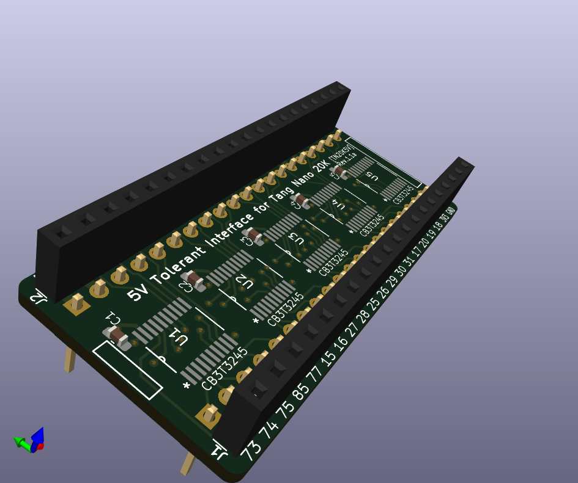
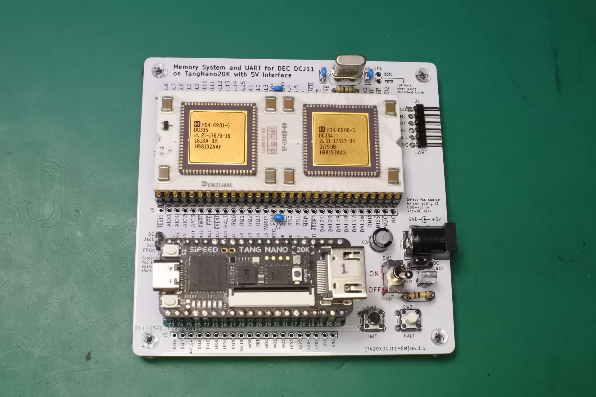
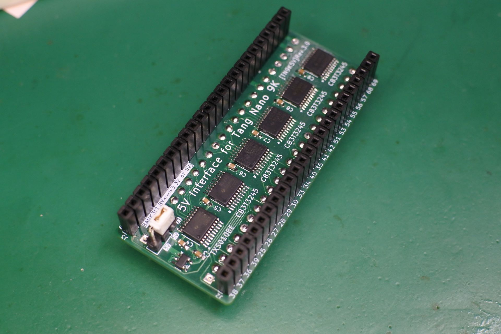

# tangnano-5V
5V tolerant interface for Tang Nano 20K and 9K

This document is written mostly in Japanese. If necessary, please use a translation service such as DeepL (I recommend this) or Google.

# 概要
Tang Nanoを5V系の回路に接続するためのインターフェースです．昔のCPU用のメモリシステムやI/OをTang Nanoに実装することを主目的に作成しました。
Tang Nano 20K用と9K用の2種類があります．(私は主に20K用を使用しており，9K用はクセがあるのであまり使用実績が無いです．)

# Tang Nano 20K 版(rev.1.1a)
## 機能
- Tang Nanoの20KのGPIO(全34本)を，SN74CB3T3245(レベルシフタ搭載バススイッチ)を介して5V系(TTL, CMOS)に接続します．
- バッファではなくスイッチで行なっているため，特に信号方向を意識することなく双方向接続が可能，信号の伝達遅延は0.25ns以下です．

## 原理
- 5V→3.3VはSN74CB3T3245によって5V系から3.3V系にレベル変換されます．
- 3.3V→5Vはレベル変換は行なわれず，3.3V系の信号が出力されますが，5VTTLの閾値は1.5V，5VCMOSの閾値は2.5Vなので問題無いということのようです．

## 動作の確認状況
- 27MHzのシステムクロックが全GPIOで5V系に出力できることを確認しました．(75番ピンについては下記参照)
- 5V系→3.3V系: 5Vの入力信号に対し，出力が3.3Vになることを確認しました．
- 3.3V系→5V系: 3.3Vの入力信号に対し，出力が3.3Vになることを確認しました．
- データシートによると遅延はmax 0.25nsで，手元のオシロでは測定限界以下でした．

## Tang Nano 20Kの75番ピンについて
- Tang Nano 20K(v3921)の75番ピンは，C51(100nF)でGNDに接続されているため，そのままだと低速(数十KHz)でしか動作しません．他のピンと同様に使用するためにはC51を外す必要があります．低速動作で構わないのであれば気にしなくていいです．
- 最新の回路図v3921(Date:2023-07-11, ファイルの日付2023-11-08)ではC51がNCになっているようです。2024年3月に購入したものがC51未実装だったという情報がありました。(2024/4/15)
- R22(10K)でGNDにプルダウンされているので、外部でプルアップすると誤動作の原因になります。

### 75番ピン以外に関するメモ
TangNano20K、pin75以外にも若干癖のあるpinがあるのでメモしておきます。
- pin15～20は510RでLEDに継がっていて入力に使うとIIL=約3.0mA。
- pin52～53は2.2Kで5VとFETに継がっててIIL=約4.4mA。
- pin26は5.1KでGND、IIH=0.6mA。
- その他のほとんどのピンはだいたいIIL=0.9mA程度、IIH=0.1mA以下。

## BOM
|Reference          |Qty| Value          |Size |Memo |
|-------------------|---|----------------|-----|-----|
|C1, C2, C3, C4, C5 |5	|0.1uF	         |1608(mm)(0603(inch))| |
|J1, J2	            |2	|pin socket      |1x20 |for Tang Nano 20K|
|J3, J4             |2	|pin header      |1x20 |for 5V GPIO|
|U1, U2, U3, U4, U5 |5	|SN74CB3T3245PW  |TSSOP| |

## 画像

# 応用例
- いろいろなCPUのメモリシステム，UARTを構築した応用例です．CPUをFPGAでエミュレートするのではなく、本物のCPUを動かすことを目的にしています。
- 勉強のために作った習作なのでかなり荒削りでいろいろと不備やバグがあると思いますがご容赦下さい。
- 各CPUで共通に使用しているUARTモジュールは適当に作ったために時々不具合が見つかってバグ修正しています．旧版との互換性は確認していないので，CPUによっては旧版のままになっています．最新版は別フォルダ [applications/uart/](applications/uart/) に置いてありますので，必要であればコピーしてご使用下さい．
- ターミナルソフトの通信遅延はCPUの速度や通信速度にあわせて適宜設定して下さい。(例: 10ms/文字, 100ms/行)

## TangNanoZ80MEM [applications/TangNanoZ80MEM](applications/TangNanoZ80MEM)
- Z80用のメモリシステムとクロック，UARTです．
- 関連ブログ [Z80をオーバークロックしてみる](https://blog.goo.ne.jp/tk-80/e/6de3708450bac79c2c1cef7728d0c877)
  
## TangNano6809MEM [applications/TangNano6809MEM](applications/TangNano6809MEM)
- MC6809用のメモリシステムとクロック，UARTです．
- [電脳伝説さんのSBC6809](https://vintagechips.wordpress.com/2017/12/05/sbc6809%E3%83%AB%E3%83%BC%E3%82%BA%E3%82%AD%E3%83%83%E3%83%88/)のdatapackに入っているBASIC9がバイナリそのままで動きます．

## TangNano8070MEM [applications/TangNano8070MEM](applications/TangNano8070MEM)
- INS8070N(SC/MP III)のメモリシステム，クロック，UARTです．
- [ElectrelicさんのUniversal Monitor](https://electrelic.com/electrelic/node/1317)が，UARTのハンドシェイク部分を微修正して動きました．

## TangNanoDCJ11MEM [ryomuk/TangNanoDCJ11MEM](https://github.com/ryomuk/TangNanoDCJ11MEM)

- DEC DCJ11 (PDP-11の命令セットを持つCPU)のメモリシステムとUARTです。
- 詳細は別リポジトリ[TangNanoDCJ11MEM](https://github.com/ryomuk/TangNanoDCJ11MEM) にあります。

# Tang Nano 9K 版(rev.3.0)[hardware/9k](hardware/9k)
- Tang Nanoの9K用のインターフェースです．あまりメンテナナスされていません．

# その他
## UARTモジュールについて [applications/uart/](applications/uart/)
- 各応用例の通信部分はSipeedのサンプル( https://github.com/sipeed/TangNano-20K-example )をベースにして独自に書き替えたものを使っています．CPU速度と通信速度によっては不安定だったりすることがあり，時々書き直してます．旧版との互換性を全部確認するのは面倒なので最新版は別のフォルダに入れることにしました．

## 参考文献，データシート等
- [SN74CB3T3245 Data sheet](https://www.ti.com/lit/ds/symlink/sn74cb3t3245.pdf)
- [Application Note CBT-C, CB3T, and CB3Q Signal-Switch Families](https://www.ti.com/lit/an/scda008c/scda008c.pdf)
- [Logic Guide, Texas Instruments](https://www.ti.com/lit/sg/sdyu001ab/sdyu001ab.pdf)
- [ロジック・ガイド(日本語版), Texas Instruments](https://www.tij.co.jp/jp/lit/sg/jajt217/jajt217.pdf)
- [5V系・3.3V系信号レベル変換, cepstrum](https://www.cepstrum.co.jp/hobby/5v33v/5v33v.html)

## 更新履歴
- 2023/06/16: 初版公開 (Tang Nano 20K用 rev.1.1)
- 2023/06/25: 応用例にTangNanoZ80MEMを追加
- 2023/06/26: TangNanoZ80MEMのピン配置を変更．(rev1.0→rev.1.1)
- 2023/06/28: TangNanoZ80MEMの uart.vを更新．
- 2023/07/06: TangNanoZ80MEMを修正．27MHz(Vcc=5.0V), 33MHz(Vcc=6.0V)で動作．
- 2023/07/11: Tang Nano 20K用 rev.1.1→rev.1.1a (差分はシルクの修正のみ)
- 2023/07/11: Tang Nano 9K用 rev.2.0公開 (若干問題あり)
- 2023/07/15: README.md用の画像を1.1aにアップデート
- 2023/07/19: 応用例にTangNano6809MEMを追加
- 2023/07/20: tn20k5v rev1.1aの実物作成，動作確認OK．写真掲載．
- 2023/07/23: 応用例にTangNano8070MEMを追加．
- 2024/04/07: uart.vのバグ修正．(tx_ready関連)
- 2024/04/11: TangNano6809MEMに関する注意事項記載
- 2024/04/12: uart.vの最新版格納用のフォルダ applications/uart を作成
- 2024/04/13: applications/uart/uart.v 更新
- 2024/04/14: README修正(応用例に関するエクスキューズを追記)
- 2024/04/15: README修正(6809、R1の除去について, TangNano20Kのピンに関するメモ)
- 2024/04/17: TangNanoZ80MEM: top.v修正(writeのバグ, RGBLED, UART_CTRL)
- 2024/04/17: TangNanoZ80MEM: rom/rom.unimon339.v 追加
- 2024/04/19: TangNanoZ80MEM: rom/bin2v.pl修正, romファイルの余計な0フィルを削除
- 2024/04/21: Tang Nano 9K用 rev.3.0公開
- 2024/04/27: TangNanoZ80MEM: UARTの送信タイミング変更
- 2024/05/07: applications/uart/にuart.v.20240507 追加
- 2024/06/21: applications/uart/にuart.v.20240621 追加
- 2024/06/21: rx_clear, tx_sendのロジックについてREADMEに追記
- 2024/07/23: READMEを階層化
